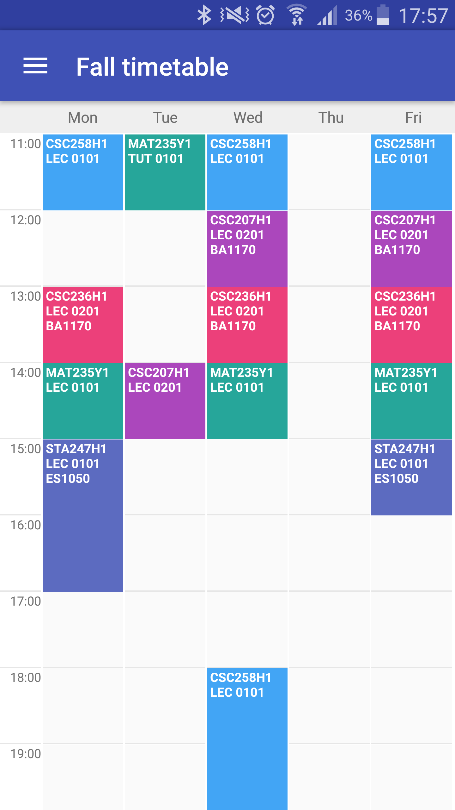
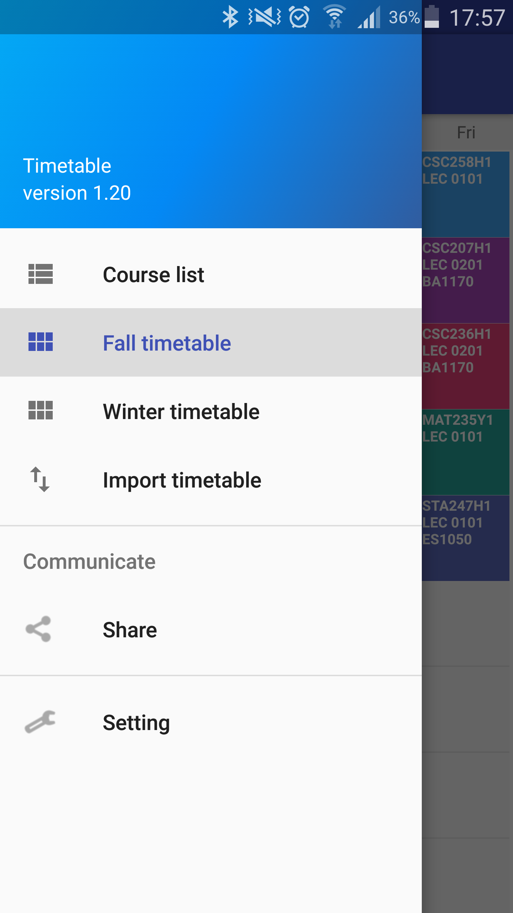
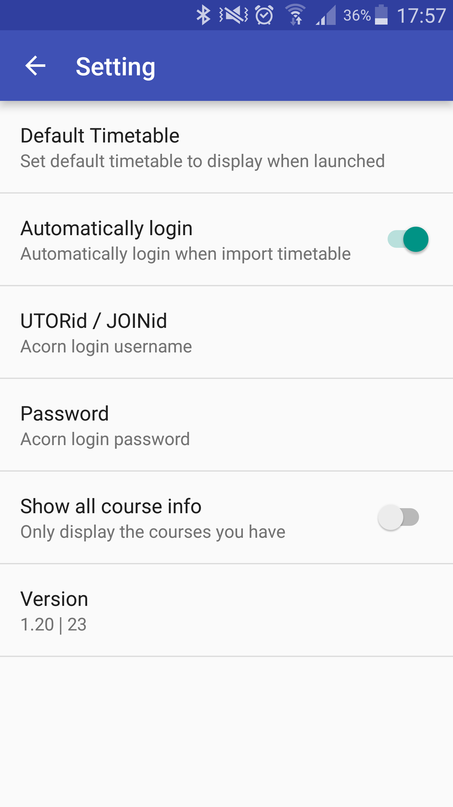

# UofT-Timetable
A Timetable Android app for University of Toronto.

## Screenshots

  

## Support
Contact me via lvds2000@gmail.com

## TODO

 - [ ] Homescreen Widget

 - [ ] Show conflicts

 - [x] Support summer timetable  
 
 - [ ] Show course info(description) in a better way

## Known Bugs (in Version 31)
### I can see all crashes on Google Play Console now even if users didn't report it. I will try to fix these bugs once I have time, after my assignments due...
 
  - [x] crash with waiting listed course
  
  `
  java.lang.NullPointerException: 
  at com.lvds2000.entity.Course.<init>(Course.java:86)
  at com.lvds2000.uoft_timetable.DrawerActivity.downloadCourseData(DrawerActivity.java:308)
  at com.lvds2000.uoft_timetable.DrawerActivity$3.run(DrawerActivity.java:257)
  `
  - [ ] crash on slow devices/networks (synchronization problem)
  
  `
  java.util.ConcurrentModificationException: 
  at java.util.ArrayList$Itr.next(ArrayList.java:831)
  at com.lvds2000.uoft_timetable.DrawerActivity.downloadCourseData(DrawerActivity.java:306)
  at com.lvds2000.uoft_timetable.TimetableFragment$1$1.run(TimetableFragment.java:141)
  `
  - [ ] can't instant update timetable if already logged in, it always re-login.
  
  - [ ] course may persist there after modification made on acorn, need to re-open this app.
  
  - [ ] some course block will be overrided if they have time conflict, please try not have too many unnecessary courses in enrollment cart for now.
  
 ## License

http://www.apache.org/licenses/LICENSE-2.0
